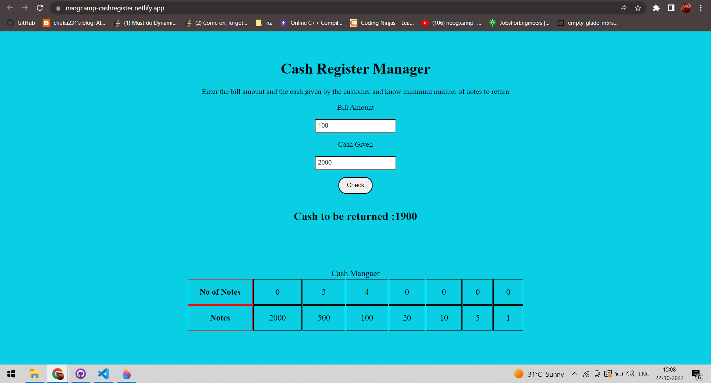

# Mark-10 : Cash register using Vanilla JavaScript

## About: 
- Application is created for calculating the change (left amount) with context to bill amount and given cash.   
- App has denominations of Rupees 1, 5, 10, 20, 100, 500, 2000.
- App has input field to enter a bill amount.
- App has input field to enter the cash given.
- As a result , the application displays the amount to be returned in change to the customer with the minimum number of notes.
- Link to the project is [here](https://neogcamp-cashregister.netlify.app/)

## Tech stack used:
1. HTML
2. CSS
3. JavaScript
4. Netlify(for deployment)

